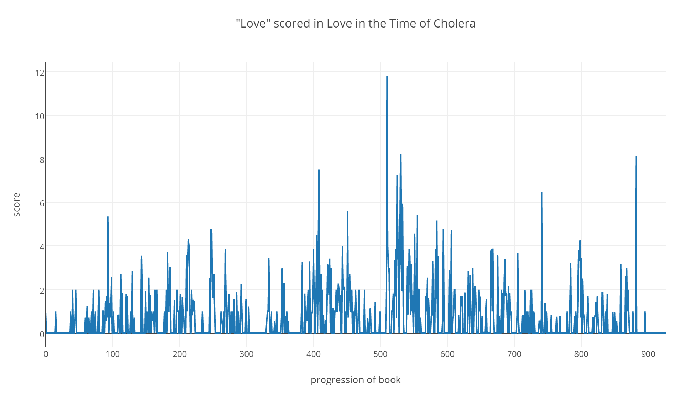
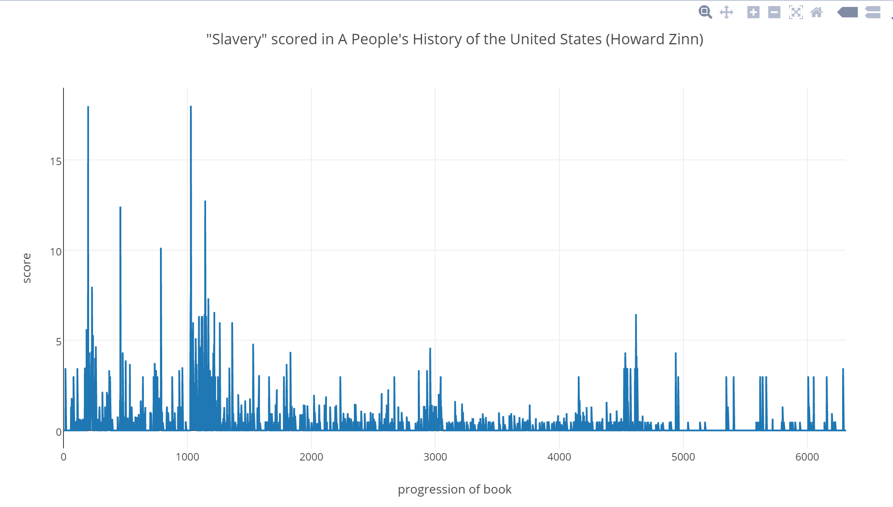
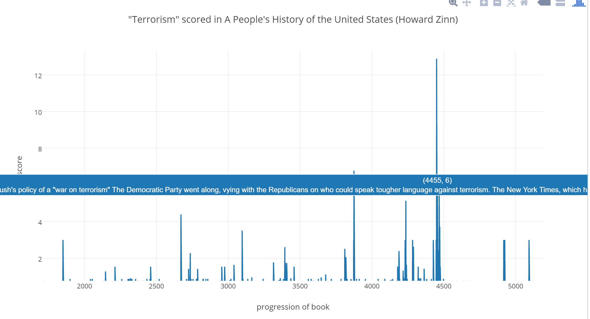

# BookQL

## Vision
The vision behind BookQL is that a user would be able to query for thematic words within books, and then see the progression over time in the form of a line graph.

## Summary
BookQL takes an input of a book and a queryTerm and traverses the book, paragraph by paragraph and scores each paragraph for the relevance of the query term in the paragraph. The program does this finding associated words and weightings using an API called Twinword increments the score of the paragraph by the weighting of any associated words it matches. The program then exports the results to a CSV file, which is visualized using Plotly

## Results

